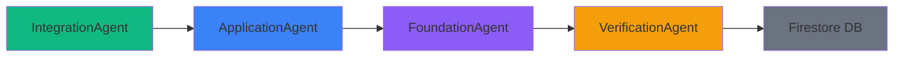

# Ailon 앱 기능 2: Academic Snaps 상세 설명 (v2)

## 📋 목차
1. [기능 개요](#기능-개요)
2. [LangGraph AI 에이전트 아키텍처](#langgraph-ai-에이전트-아키텍처)
3. [3단계 콘텐츠 구조](#3단계-콘텐츠-구조)
4. [10개 학문 분야 체계](#10개-학문-분야-체계)
5. [실행 흐름 및 자동화](#실행-흐름-및-자동화)

---

## 기능 개요

**Academic Snaps**는 Simulated Annealing과 같이 **기본-응용-융합** 3단계로 구성된 학제간 융합 사례를 제공하는 Ailon의 두 번째 핵심 기능입니다.

### 핵심 가치
- **심화 학습**: 하루 1개 학문을 3단계로 깊이 있게 학습
- **융합 사고**: 기본 → 응용 → 융합 흐름으로 학제간 연결 이해
- **실제 사례**: 한 학문의 원리가 다른 학문의 문제를 해결한 융합 사례
- **다양한 분야**: AI뿐만 아니라 의학, 건축, 음악, 재료공학 등 모든 분야

### 콘텐츠 예시: X-선 결정학 (물리학 → 생물학)

**기본 (Foundation)**: 물리학의 X-선 회절 원리
```
X-선을 결정 구조에 쪼이면, 규칙적으로 배열된 원자들이 X-선을 특정 패턴으로 회절시켜요.
이 회절 패턴을 분석하면 원자들의 3차원 배치를 알아낼 수 있답니다.
마치 그림자를 보고 물체의 모양을 추측하는 것과 비슷해요.
```

**응용 (Application)**: 구조 생물학/결정학
```
X-선 회절 기술을 생물학적 분자(단백질, DNA 등)에 적용하면,
분자의 3차원 구조를 원자 수준에서 볼 수 있어요.
이전에는 불가능했던 생명의 미시 세계를 들여다볼 수 있게 된 거죠.
```

**융합 (Integration)**: DNA 이중나선 구조 발견
```
로잘린드 프랭클린의 X-선 회절 사진(Photo 51)이 DNA의 이중나선 구조를 밝혀냈어요.
물리학 기술이 생물학의 가장 근본적인 질문 "생명의 설계도는 어떻게 생겼는가?"를 해결한 거예요.
이 발견은 현대 분자생물학, 유전공학, 의학의 토대가 되었답니다.
```

---

## LangGraph AI 에이전트 아키텍처 (v2 - 역방향 파이프라인)

Academic Snaps v2는 **4개의 전문화된 AI 에이전트**가 **역방향(Top-Down)** 순서로 협력하여 정확한 융합 사례를 생성합니다.



### 에이전트 파이프라인 (역방향)

| 순서 | 에이전트 | 입력 | 출력 | 역할 |
|------|---------|------|------|------|
| 1 | **IntegrationAgent** | 학문 분야 정보 | 융합 사례 | **유명한 융합 사례를 먼저 선정** ✨ |
| 2 | **ApplicationAgent** | 융합 사례 | 응용 원리 | 융합 사례에서 **응용 원리 역추적** |
| 3 | **FoundationAgent** | 융합 + 응용 | 기본 원리 | 응용 원리에서 **기본 원리 역추적** |
| 4 | **VerificationAgent** | 전체 정보 | 검증 결과 | **웹 검색으로 사실 확인** 🔍 |

### 왜 역방향인가?

**정확성(Accuracy)** 최우선:
- ✅ **유명한 사례부터**: Simulated Annealing, 신경망, 유전 알고리즘 등 검증된 사례에서 출발
- ✅ **Hallucination 방지**: 기본 원리에서 시작하면 LLM이 융합 사례를 지어낼 위험
- ✅ **웹 검증**: Tavily API로 실제 존재 여부 확인

**4회 LLM 호출/일** (integration → application → foundation → verification)

### 📱 사용자 화면 표시 순서

**생성 순서 (내부)**: 융합 → 응용 → 기본 → 검증  
**표시 순서 (화면)**: **기본 → 응용 → 융합** ✨

사용자에게는 학습 흐름에 맞게 **기본 원리부터 시작**하여 융합 사례까지 자연스럽게 이해할 수 있도록 표시합니다.

---

## 3단계 콘텐츠 구조 (생성 순서대로)

### 1️⃣ Integration (융합 사례) — **먼저 생성** ✨

**IntegrationAgent**: 학제간 융합 사례를 먼저 선정 (AI가 아니어도 됨)

**출력 필드**:
```typescript
{
  title: string;                // 융합 사례 이름
  originalTitle: string;        // 영문 원제 (있다면)
  problemSolved: string;        // 해결한 문제 또는 향상시킨 부분
  solution: string;             // 해결 방법 (150-200자)
  targetField: string;          // 영향받은 학문 분야
  realWorldExamples: string[];  // 실제 사례 3-4개
  impactField: string;          // 영향 분야들
  whyItWorks: string;           // 효과적인 이유
}
```

**예시**:
```json
{
  "title": "X-선 결정학",
  "originalTitle": "X-ray Crystallography",
  "problemSolved": "생명 분자의 3차원 구조를 알 수 없었던 문제",
  "solution": "물리학의 X-선 회절 기술을 생물학 분자에 적용하여 원자 수준의 구조를 밝혀냈어요",
  "targetField": "생물학, 의학, 약학",
  "realWorldExamples": ["DNA 이중나선 구조 발견", "단백질 구조 분석", "신약 설계"],
  "impactField": "생물학, 의학, 약학, 유전공학",
  "whyItWorks": "물리학의 정밀한 측정 기술이 생명의 미시 세계를 볼 수 있게 해줬어요"
}
```

---

### 2️⃣ Application (응용 원리) — **역추적**

**ApplicationAgent**: 융합 사례에서 응용 원리를 역추적

**출력 필드**:
```typescript
{
  applicationField: string;     // 응용 분야
  description: string;          // 응용 설명 (200-300자)
  mechanism: string;            // 응용 메커니즘 한 줄
  technicalTerms: string[];     // 관련 기술 용어 3-5개
  bridgeRole: string;           // 기본 원리와 융합 사례를 연결하는 역할
}
```

**예시**:
```json
{
  "applicationField": "통계 물리학/최적화 알고리즘",
  "description": "높은 '온도(변수)'를 설정해 무작위로 답을 찾다가, 시간이 흐를수록 '온도'를 낮추며...",
  "mechanism": "온도를 낮추며 탐색 범위를 좁혀가는 방식이에요",
  "technicalTerms": ["확률적 탐색", "전역 최적화", "메트로폴리스 알고리즘"],
  "bridgeRole": "물리학의 에너지 최소화 원리를 수학적 최적화 문제로 변환했어요"
}
```

---

### 3️⃣ Foundation (기본 원리) — **근원 찾기**

**FoundationAgent**: 응용 원리의 근원이 된 기본 원리 역추적

**출력 필드**:
```typescript
{
  title: string;                // 원리 이름
  principle: string;            // 기본 원리 설명 (200-300자)
  keyIdea: string;              // 핵심 아이디어 한 줄
  everydayAnalogy: string;      // 일상 비유
  scientificContext: string;    // 해당 학문에서 이 원리가 중요한 이유
}
```

**예시**:
```json
{
  "title": "담금질(Annealing)",
  "principle": "금속을 높은 온도로 가열 후 천천히 냉각시키면, 원자들이 가장 안정적인 결정 구조를 갖게 돼요...",
  "keyIdea": "천천히 식히면 에너지가 가장 낮은 안정한 상태에 도달해요",
  "everydayAnalogy": "퍼즐 조각을 맞출 때 여유롭게 하나씩 맞추는 것과 비슷해요",
  "scientificContext": "물리학에서 재료의 물성을 개선하는 핵심 공정이에요"
}
```

---

### 4️⃣ Verification (검증) — **사실 확인** 🔍

**VerificationAgent**: Tavily API로 웹 검색하여 정보 검증

**출력 필드**:
```typescript
{
  verified: boolean;            // 검증 통과 여부
  confidence: number;           // 신뢰도 (0.0-1.0)
  sources: Array<{              // 검증 소스 (위키피디아, 논문 등)
    title: string;
    url: string;
  }>;
  factCheck: string;            // 검증 결과 설명
}
```

**예시**:
```json
{
  "verified": true,
  "confidence": 0.8,
  "sources": [
    {"title": "Simulated annealing - Wikipedia", "url": "https://en.wikipedia.org/wiki/Simulated_annealing"},
    {"title": "Optimization by Simulated Annealing - Science", "url": "https://..."}
  ],
  "factCheck": "웹 검색 결과 이 융합 사례는 실제로 존재해요. Simulated Annealing은 1983년 Kirkpatrick이 제안한..."
}
```

---

## 10개 학문 분야 체계

```
기초과학 (3개)
├── 수학 (mathematics)
├── 물리학 (physics)
└── 화학 (chemistry)

생명과학 (2개)
├── 생물학 (biology)
└── 의학/뇌과학 (medicine_neuroscience)

공학 (2개)
├── 컴퓨터공학 (computer_science)
└── 전기전자공학 (electrical_engineering)

사회과학 (2개)
├── 경제학 (economics)
└── 심리학/인지과학 (psychology_cognitive_science)

인문학 (1개)
└── 철학/윤리학 (philosophy_ethics)
```

**순환 시스템**: 10일 주기로 매일 1개 학문 분야 선택

---

## 실행 흐름 및 자동화

### 일일 실행

**실행 시점**: 매일 오전 6시 (KST)
**실행 주체**: GitHub Actions
**실행 스크립트**: `scripts/generate_daily.py`

### Firestore 데이터 구조

```json
{
  "date": "2026-02-17",
  "discipline_key": "physics",
  "discipline_info": {
    "name": "물리학",
    "focus": "양자컴퓨팅, 열역학, 통계역학, 정보 이론",
    "ai_connection": "양자머신러닝, 물리 시뮬레이션, 에너지 효율적 계산",
    "key": "physics",
    "superCategory": "기초과학"
  },
  "principle": {
    "title": "담금질(Annealing)",
    "category": "physics",
    "superCategory": "기초과학",
    "foundation": {
      "principle": "금속을 높은 온도로 가열 후...",
      "keyIdea": "천천히 식히면 에너지가 가장 낮은 안정한 상태",
      "everydayAnalogy": "퍼즐 조각을 여유롭게..."
    },
    "application": {
      "applicationField": "통계 물리학/최적화",
      "description": "높은 '온도'를 설정해...",
      "mechanism": "온도를 낮추며 탐색 범위를 좁혀가는 방식",
      "technicalTerms": ["확률적 탐색", "전역 최적화", "메트로폴리스 알고리즘"]
    },
    "integration": {
      "problemSolved": "AI 로컬 미니마 문제",
      "solution": "담금질 기법으로 확률적 도박 허용...",
      "realWorldExamples": ["물류 배송 최적화", "반도체 칩 설계", "단백질 폴딩"],
      "impactField": "AI, 물류, 반도체, 생명과학",
      "whyItWorks": "국소 최적해에 갇히지 않고 전역 최적해 탐색 가능"
    },
    "learn_more_links": [...]
  },
  "updated_at": "2026-02-17T06:30:00Z"
}
```

---

## 요약

### 핵심 특징

1. **하루 1개 학문**: 10일 주기 순환
2. **3단계 구조**: 기본 → 응용 → 융합
3. **3개 에이전트**: FoundationAgent → ApplicationAgent → IntegrationAgent
4. **실제 사례**: Simulated Annealing처럼 다른 학문 문제 해결
5. **다양한 분야**: AI뿐만 아니라 물류, 반도체, 생명과학 등

### LLM 사용 효율

**3회/일** (기존 12회 대비 75% 감소)

**월 비용**: ~$0.03 (Gemini 2.5 Flash 기준, 기존 $0.11 대비 73% 절감)

### 기존 대비 개선사항

| 항목 | 기존 (v1) | 신규 (v2) |
|-----|----------|----------|
| 하루 학문 수 | 3개 | 1개 |
| 콘텐츠 구조 | 단일 원리 | 3단계 (기본-응용-융합) |
| 에이전트 수 | 4개 | 3개 |
| LLM 호출 | 12회/일 | 3회/일 |
| 학습 깊이 | 얕고 넓음 | 깊고 융합적 |

이 시스템을 통해 Ailon은 사용자에게 **매일 1개 학문의 심화된 융합 사례**를 제공합니다! 🔬✨
