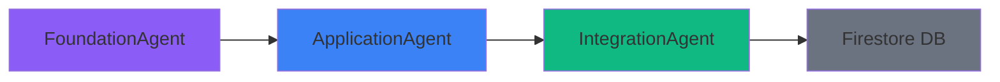

# Ailon 앱 기능 2: Academic Snaps 상세 설명 (v2)

## 📋 목차
1. [기능 개요](#기능-개요)
2. [LangGraph AI 에이전트 아키텍처](#langgraph-ai-에이전트-아키텍처)
3. [3단계 콘텐츠 구조](#3단계-콘텐츠-구조)
4. [10개 학문 분야 체계](#10개-학문-분야-체계)
5. [실행 흐름 및 자동화](#실행-흐름-및-자동화)

---

## 기능 개요

**Academic Snaps**는 Simulated Annealing과 같이 **기본-응용-융합** 3단계로 구성된 학제간 융합 사례를 제공하는 Ailon의 두 번째 핵심 기능입니다.

### 핵심 가치
- **심화 학습**: 하루 1개 학문을 3단계로 깊이 있게 학습
- **융합 사고**: 기본 → 응용 → 융합 흐름으로 학제간 연결 이해
- **실제 사례**: Simulated Annealing처럼 다른 학문의 문제를 해결한 융합 사례
- **AI 중심이 아님**: AI뿐만 아니라 다양한 분야의 문제 해결 사례 포함

### 콘텐츠 예시: Simulated Annealing (물리학)

**기본 (Foundation)**: 물리학의 담금질 원리
```
금속 재료를 아주 높은 온도로 가열했다가 천천히 냉각시키면, 
금속 내부의 원자들이 자유롭게 움직이다가 가장 안정적인 결정 구조를 갖게 돼요. 
이를 '담금질(Annealing)'이라고 해요. 
급하게 식히면 불순물이 갇히지만, 천천히 식히면 에너지가 가장 낮은 안정한 상태에 도달하게 된답니다.
```

**응용 (Application)**: 통계 물리/최적화 알고리즘
```
이 원리를 복잡한 수학적 문제에 대입해 보는 거예요. 
아주 높은 '온도(변수)'를 설정해 처음에는 무작위로 답을 찾아보게 하다가, 
시간이 흐를수록 '온도'를 낮추며 정답일 확률이 높은 쪽으로 탐색 범위를 좁혀가는 방식이에요.
```

**융합 (Integration)**: 다른 학문의 문제 해결
```
이 기법은 AI의 '로컬 미니마(Local Minima)' 문제를 해결하는 데 쓰여요. 
인공지능이 학습 중 가짜 정답(지역 최솟값)에 빠졌을 때, 
담금질 기법처럼 '확률적인 도박'을 허용함으로써 그 구덩이를 빠져나와 
진짜 정답(전역 최솟값)을 찾게 도와준답니다. 
복잡한 물류 배송 경로 최적화나 반도체 칩 설계 등에 핵심적으로 쓰이고 있어요.
```

---

## LangGraph AI 에이전트 아키텍처

Academic Snaps는 **3개의 전문화된 AI 에이전트**가 LangGraph 프레임워크를 통해 순차적으로 협력합니다.



### 에이전트 파이프라인

| 순서 | 에이전트 | 입력 | 출력 | LLM 사용 |
|------|---------|------|------|----------|
| 1 | FoundationAgent | 학문 분야 정보 | 기본 원리 | ✅ (1회) |
| 2 | ApplicationAgent | 기본 원리 | 응용 사례 | ✅ (1회) |
| 3 | IntegrationAgent | 기본 + 응용 | 융합 사례 | ✅ (1회) |

**총 3회 LLM 호출/일** (기존 12회 대비 75% 감소)

---

## 3단계 콘텐츠 구조

### 1️⃣ Foundation (기본 원리)

**FoundationAgent**: 해당 학문의 기본 원리를 쉽고 친근하게 설명

**출력 필드**:
```typescript
{
  title: string;                // 원리 이름
  principle: string;            // 기본 원리 설명 (200-300자)
  keyIdea: string;              // 핵심 아이디어 한 줄 (50자 이내)
  everydayAnalogy: string;      // 일상 비유 (100-150자)
}
```

**예시**:
```json
{
  "title": "담금질(Annealing)",
  "principle": "금속을 높은 온도로 가열 후 천천히 냉각시키면, 원자들이 가장 안정적인 결정 구조를 갖게 돼요...",
  "keyIdea": "천천히 식히면 에너지가 가장 낮은 안정한 상태에 도달해요",
  "everydayAnalogy": "퍼즐 조각을 맞출 때 여유롭게 하나씩 맞추는 것과 비슷해요"
}
```

---

### 2️⃣ Application (응용 사례)

**ApplicationAgent**: 기본 원리를 다른 영역(통계, 계산, 공학 등)에 응용

**출력 필드**:
```typescript
{
  applicationField: string;     // 응용 분야
  description: string;          // 응용 설명 (200-300자)
  mechanism: string;            // 응용 메커니즘 한 줄 (50-80자)
  technicalTerms: string[];     // 관련 기술 용어 3-5개
}
```

**예시**:
```json
{
  "applicationField": "통계 물리학/최적화 알고리즘",
  "description": "높은 '온도(변수)'를 설정해 무작위로 답을 찾다가, 시간이 흐를수록 '온도'를 낮추며...",
  "mechanism": "온도를 낮추며 탐색 범위를 좁혀가는 방식이에요",
  "technicalTerms": ["확률적 탐색", "전역 최적화", "메트로폴리스 알고리즘"]
}
```

---

### 3️⃣ Integration (융합 사례)

**IntegrationAgent**: 다른 학문의 실제 문제를 해결한 융합 사례

**출력 필드**:
```typescript
{
  problemSolved: string;        // 해결한 문제 (50자 이내)
  solution: string;             // 해결 방법 (150-200자)
  realWorldExamples: string[];  // 실제 사례 3-4개
  impactField: string;          // 영향 분야들 (80자 이내)
  whyItWorks: string;           // 효과적인 이유 (100-150자)
}
```

**예시**:
```json
{
  "problemSolved": "AI 로컬 미니마 문제",
  "solution": "담금질 기법으로 확률적 도박을 허용하여 전역 최솟값 탐색...",
  "realWorldExamples": [
    "물류 배송 경로 최적화",
    "반도체 칩 설계(VLSI)",
    "단백질 폴딩 예측"
  ],
  "impactField": "AI, 물류, 반도체, 생명과학",
  "whyItWorks": "국소 최적해에 갇히지 않고 전역 최적해를 찾을 수 있음"
}
```

---

## 10개 학문 분야 체계

```
기초과학 (3개)
├── 수학 (mathematics)
├── 물리학 (physics)
└── 화학 (chemistry)

생명과학 (2개)
├── 생물학 (biology)
└── 의학/뇌과학 (medicine_neuroscience)

공학 (2개)
├── 컴퓨터공학 (computer_science)
└── 전기전자공학 (electrical_engineering)

사회과학 (2개)
├── 경제학 (economics)
└── 심리학/인지과학 (psychology_cognitive_science)

인문학 (1개)
└── 철학/윤리학 (philosophy_ethics)
```

**순환 시스템**: 10일 주기로 매일 1개 학문 분야 선택

---

## 실행 흐름 및 자동화

### 일일 실행

**실행 시점**: 매일 오전 6시 (KST)
**실행 주체**: GitHub Actions
**실행 스크립트**: `scripts/generate_daily.py`

### Firestore 데이터 구조

```json
{
  "date": "2026-02-17",
  "discipline_key": "physics",
  "discipline_info": {
    "name": "물리학",
    "focus": "양자컴퓨팅, 열역학, 통계역학, 정보 이론",
    "ai_connection": "양자머신러닝, 물리 시뮬레이션, 에너지 효율적 계산",
    "key": "physics",
    "superCategory": "기초과학"
  },
  "principle": {
    "title": "담금질(Annealing)",
    "category": "physics",
    "superCategory": "기초과학",
    "foundation": {
      "principle": "금속을 높은 온도로 가열 후...",
      "keyIdea": "천천히 식히면 에너지가 가장 낮은 안정한 상태",
      "everydayAnalogy": "퍼즐 조각을 여유롭게..."
    },
    "application": {
      "applicationField": "통계 물리학/최적화",
      "description": "높은 '온도'를 설정해...",
      "mechanism": "온도를 낮추며 탐색 범위를 좁혀가는 방식",
      "technicalTerms": ["확률적 탐색", "전역 최적화", "메트로폴리스 알고리즘"]
    },
    "integration": {
      "problemSolved": "AI 로컬 미니마 문제",
      "solution": "담금질 기법으로 확률적 도박 허용...",
      "realWorldExamples": ["물류 배송 최적화", "반도체 칩 설계", "단백질 폴딩"],
      "impactField": "AI, 물류, 반도체, 생명과학",
      "whyItWorks": "국소 최적해에 갇히지 않고 전역 최적해 탐색 가능"
    },
    "learn_more_links": [...]
  },
  "updated_at": "2026-02-17T06:30:00Z"
}
```

---

## 요약

### 핵심 특징

1. **하루 1개 학문**: 10일 주기 순환
2. **3단계 구조**: 기본 → 응용 → 융합
3. **3개 에이전트**: FoundationAgent → ApplicationAgent → IntegrationAgent
4. **실제 사례**: Simulated Annealing처럼 다른 학문 문제 해결
5. **다양한 분야**: AI뿐만 아니라 물류, 반도체, 생명과학 등

### LLM 사용 효율

**3회/일** (기존 12회 대비 75% 감소)

**월 비용**: ~$0.03 (Gemini 2.5 Flash 기준, 기존 $0.11 대비 73% 절감)

### 기존 대비 개선사항

| 항목 | 기존 (v1) | 신규 (v2) |
|-----|----------|----------|
| 하루 학문 수 | 3개 | 1개 |
| 콘텐츠 구조 | 단일 원리 | 3단계 (기본-응용-융합) |
| 에이전트 수 | 4개 | 3개 |
| LLM 호출 | 12회/일 | 3회/일 |
| 학습 깊이 | 얕고 넓음 | 깊고 융합적 |

이 시스템을 통해 Ailon은 사용자에게 **매일 1개 학문의 심화된 융합 사례**를 제공합니다! 🔬✨
